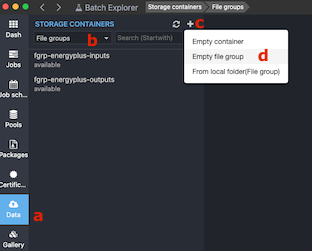
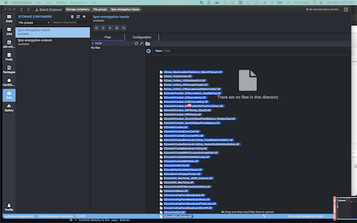
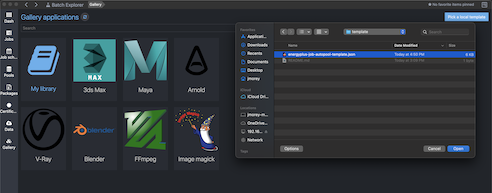

# EnergyPlus™ on Azure Batch
This repo will implement the [EnergyPlus™](https://energyplus.net/) program on Azure Batch.  EnergyPlus™ is an open-source program provided by Department of Energy that provides whole building energy simulation for engineers, architects, and researchers to model both energy consumption—for heating, cooling, ventilation, lighting and plug and process loads—and water use in buildings. 

EnergyPlus™ has been configured to use Azure Batch Explorer (ABE) desktop app to submit a job to Azure Batch using an autopool.  From a high level, the following steps are performed:

  1. Add input files to the FileGroup named _fgrp-energyplus-inputs_  
  2. Run the _energyplus-job-autopool-template.json_ file from ABE Gallery  
  3. Azure Batch autopool is created and jobs are run 
  5. The job output & std*.txt are uploaded to _fgrp-energyplus-outputs_ when the tasks are complete  
  6. the autopool is deleted  

## Azure Services/Tools Used
  - [Azure Batch](https://docs.microsoft.com/en-us/azure/batch/)
  - [Azure Key Vault](https://docs.microsoft.com/en-us/azure/key-vault/general/)
  - [Azure Storage](https://docs.microsoft.com/en-us/azure/storage/blobs/)
  - [Azure Batch Explorer](https://azure.github.io/BatchExplorer/)
  - [Azure CLI](https://docs.microsoft.com/en-us/cli/azure/)
  - [Azure Cloud Shell](https://docs.microsoft.com/en-us/azure/cloud-shell/overview)
  - [Windows Subsystem for Linux (WSL)](https://docs.microsoft.com/en-us/windows/wsl/install-win10#manual-installation-steps)

## Pre-Reqs
  1. Install [ABE](https://azure.github.io/BatchExplorer/) and [Azure CLI](https://docs.microsoft.com/en-us/cli/azure/install-azure-cli) (if not already installed)
      - alternatively use Azure Cloud Shell instead of installing Azure CLI on your local computer  
  2. Install Azure Batch Extension for Azure CLI:  `az extension add -n azure-batch-cli-extensions`  
  3. Install `Git` to clone this repo (_**NOTE:** on Windows use WSL for steps 3-5...alternatively Azure Cloud Shell_)
      > sudo mkdir /energyplus && sudo chown $USER /energyplus
      > git clone https://github.com/themorey/energyplus-batch-template.git /energyplus
  
  4. Download EnergyPlus™ to the machine to run the Batch config script  
      > wget -O /energyplus/EnergyPlus-9.4.0-998c4b761e-Windows-x86_64.zip https://github.com/NREL/EnergyPlus/releases/download/v9.4.0/EnergyPlus-9.4.0-998c4b761e-Windows-x86_64.zip
  
  5. [Register Batch Resource Provider](https://docs.microsoft.com/en-us/azure/batch/batch-account-create-portal#allow-azure-batch-to-access-the-subscription-one-time-operation)  

  6. Create Azure Batch account if not already created (use included script in _scripts/azure-batch-account-create-energyplus.sh_)  
 
      > \## _Run the script to create an Azure Batch account with EnergyPlus App:_  
      > cd /energyplus/scripts/  
      > vim azure-batch-account-create-energyplus.sh  ##NOTE: update variables as needed  
      > chmod +x azure-batch-account-create-energyplus.sh  
      > ./azure-batch-account-create-energyplus.sh  

## Instructions
  1. Create FileGroup named _fgrp-energyplus-input_ in ABE "Data"  

        
      
      a.  Click "Data" on left vertical menu  
      b.  Click dropdown for "STORAGE CONTAINERS" and select "File Groups"  
      c.  Click "+" to add a new File Group  
      d.  Select "Empty file group" and in the popup enter the name "energyplus-inputs"  (do **NOT** add _fgrp-_ here it will be auto added)
      
  2.  Add input files to _fgrp-energyplus-inputs_ by selecting your files and dragging them to the ABE/data/_fgrp-energyplus-inputs_ window  
    
        
      
  3.  Click "_Gallery_" on the ABE left vertical menu  
  4.  Select the "_Pick a local template_" button on the top right  
  5.  In the popup window, navigate to the cloned git repo template folder and select the `energyplus-job-autopool-template.json` file  
  
      
      
  6.  Input Job parameters:  

        
 
       a.  enter a Pool name (ie. `azdemo-pool`)  
       b.  enter a Job name  (ie. `azdemo-job-1`)  
       c.  enter # of VMs to run in the Pool (ie. `10`)  
       d.  enter the VM size (ie. `Standard_D4as_v4`)  
       e.  enter the tasks per VM (ie. `1` task per Standard_D4as_v4; `2` tasks for Standard_D8as_v4)  
       f.  enter the filename (plus extension) of the Weather file to use  
       
  7.  Click `Run` and monitor the Jobs and Pools in ABE  
  8.  View output and stderr/stdout files in _fgrp-energyplus-outputs_
