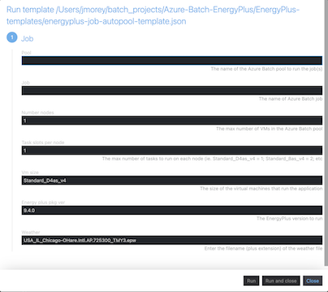

# EnergyPlus on Azure Batch
This repo will implement the [EnergyPlus](https://energyplus.net/) program on Azure Batch.  It has been configured to use Azure Batch Explorer (ABE) desktop app to submit a job to Azure Batch using an autopool.  From a high level, the following steps are performed:

  1. Run the _job.template.json_ file from ABE Gallery
  2. Set the parameters in the popup   
    a. Add input files to the FileGroup named fgrp-energyplus-inputs
    b. enter a Pool name  
    b. enter a Job name  
    c. enter # of VMs to run in the Pool
    d. enter the VM size (ie. Standard_D4as_v4)
    e. enter the tasks per VM (ie. 1 task per Standard_D4as_v4; 2 tasks for Standard_D8as_v4)
    f. enter the filename (plus extension) of the Weather file to use
  3. Click _Run_ and monitor the Jobs and Pools in ABE
  4. Output is uploaded fgrp-energyplus-outputs when the tasks are complete
  5. the autopool is deleted  

## Azure Tools/Services Used
  - [Azure Batch](https://docs.microsoft.com/en-us/azure/batch/)
  - [Azure Batch Explorer](https://azure.github.io/BatchExplorer/)
  - [Azure CLI](https://docs.microsoft.com/en-us/cli/azure/)

## Pre-Reqs
  1. Install [ABE](https://azure.github.io/BatchExplorer/)a and [CLI](https://docs.microsoft.com/en-us/cli/azure/install-azure-cli) if not already installed
  2. Install Azure Batch Extension for Azure CLI:  _az extension add -n azure-batch-cli-extensions_  
  3. Create Azure Batch account if not already created (_scripts/azure-batch-account-create-energyplus.sh_)  
  4. 
